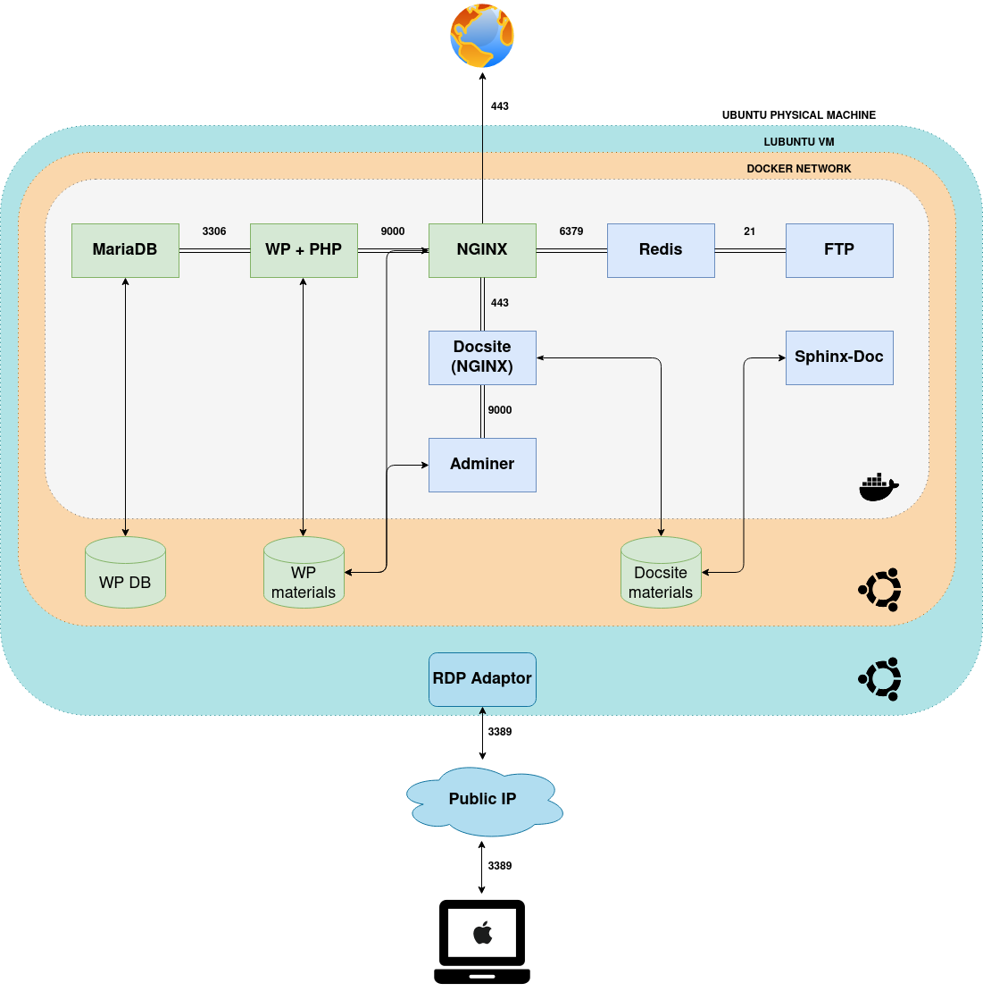

INCEPTION: описание проекта
=================================

**Inception** -  проект Школы 21, направленный на расширение знаний по виртуализации и системному администрированию.
Проект пришел на смену **FT_SERVICES** в 2021 году в связи с пересмотром графа и стремлением Школы отказаться от Kubernetes, на основе которого строился предыдущий проект.
Вероятно, это решение было принято по причине высокой сложности развертывания Kubernetes на локальной машине без предустановленных решений для локального развертывания (Minikube, microk8s) и большого количества специфических проблем, связанных с локальными программами и косвенно влияющих на сам проект.

Для оркестрации контейнеров в Inception применяется **docker-compose** - основная технология, изучаемая в ходе проекта.
Docker-compose позволяет организовать взаимодействие между несколькими контейнерами как микросервисами в рамках одной виртуальной сети (Docker network).
Сценарный файл ``docker-compose.yml`` обеспечивает автоматизированную сборку образов микросервисов на основе Dockerfile и исходных материалов, а затем их последовательное развертывание.
Также docker-compose позволяет настроить перезапуск контейнеров в случае их отключения и монтировать директории физической машины в файловых системах контейнеров в виде томов.

Технологии базовой части
---------------------------

Для выполнения базовой части проекта применяются следующие технологии:

* **Виртуальная машина** - предлагается выполнять проект на виртуальной машине. Виртуальные машины отлично подходят для полной изоляции процесса для приложения: почти никакие проблемы основной операционной системы не могут повлиять на софт гостевой ОС, и наоборот. Но за такую изоляцию приходится платить. Существует значительная вычислительная нагрузка, необходимая для виртуализации железа гостевой ОС.
* **Docker** и **docker-compose** - на виртуальной машине предлагается развернуть сеть (**docker-network**) из нескольких контейнеров с микросервисами, перечисленными ниже. Каждый микросервис упакован в отдельный контейнер. Контейнеры предоставляют схожий с виртуальными машинами уровень изоляции, но благодаря правильному задействованию низкоуровневых механизмов основной операционной системы делают это с в разы меньшей нагрузкой.
* **NGINX** - веб-сервер, обеспечивающий доступ к материалам, расположенным на машине, маршрутизацию, авторизацию и шифрование. В проекте микросервис с NGINX является единственным портом в сеть, маршрутизирующим пользователя на другие доступные микросервисы. Также на NGINX настраивается SSL и TLS-шифрование.
* **Wordpress** - система управления контентом веб-сайта, знакомая еще с проекта **FT_SERVER**. В проекте готовый веб-сайт на Wordpress применяется как основной материал, доступный на адресе проекта. Материалы сайта хранятся в файловой системе виртуальной машины.
* **MariaDB** - система управления базами данных SQL. Также применялась в проекте **FT_SERVER**. Используется в проекте для хранения БД Wordpress, материалы БД хранятся в файловой системе виртуальной машины.

Технологии бонусной части
----------------------------

* **Redis** - система кеширования материалов сайта в собственную базу данных `ключ:значение`. В проекте используется для кеширования материалов Wordpress, слушая его контейнер. БД Redis располагается в его контейнере.
* **FTP-сервер** - отдельный контейнер, обеспечивающий передачу файлов по FTP в том Wordpress.
* **Статический веб-сайт** - веб-сайт с аобственным эндпоинтом, материалы которого располагаются в отдельном контейнере. Может применять собственный том. Может быть написан с использованием любых технологий кроме PHP.
* **Adminer** - легковесная система управления БД, аналог PhpMyAdmin. Не имеет зависимостей, состоит из одного PHP-файла. Разворачивается в отдельном контейнере, используется в проекте для управления сохраненной БД.

Дополнительные технологии, примененные в решении fmira
----------------------------------------------------------

* **Sphinx** - генератор статических веб-сайтов на HTML, основанный на Python. Применяется в качестве движка для создания каталогов технической документации. Развернут в отдельном контейнере со своим собственным томом. Конвертирует RST-файлы из тома в HTML-каталог, который затем передает в том статического веб-сайта. ПОсле генерации HTML-каталога завершается. Может быть перезапущен для повторной генерации каталога в случае замены RST-файлов.
* **RDP** - проект сдается на MacBook Air, который соединяется по протоколу удаленного рабочего стола (RDP) с ноутбуком на Ubuntu, на котором установлена виртуальная машина с Lubuntu, в которой разворачиваются контейнеры с микросервисами (см. схему).

Общая схема решения
----------------------

Описание дополнительных скриптов корневого каталога
------------------------------------------------------

В корневом каталоге проекта расположены скрипты для запуска, завершения и отладки микросервисов.

.. csv-table::
    :header: "Имя скрипта","Цель","Описание"

    backup.sh     ,Отладка ,Создание бекапа физических томов Wordpress MariaDB и Docsite
    connect-adminer.sh     ,Отладка ,Подключение к контейнеру Adminer
    connect-docsite.sh     ,Отладка ,Подключение к контейнеру Docsite
    connect-ftp.sh     ,Отладка ,Подключение к контейнеру FTP
    connect-mysql.sh     ,Отладка ,Подключение к контейнеру MariaDB
    connect-nginx.sh     ,Отладка ,Подключение к контейнеру NGINX
    connect-redis.sh     ,Отладка ,Подключение к контейнеру Redis
    connect-wp.sh     ,Отладка ,Подключение к контейнеру Wordpress
    force-stop.sh     ,Отладка ,Аварийное отключение всех контейнеров в случае неполадок Docker-Machine (запрет на остановку контейнеров или баг docker-compose)
    login_db.sh     ,Запуск микросервиса ,Подключение к БД Wordpress для демонстрации
    reload.sh     ,Отладка ,Удаление физических томов вместе с контейнерами и образами из системы
    restore.sh     ,Отладка ,Восстановление бекапа. Требуется переназначение прав доступа
    sphinx-re.sh     ,Запуск микросервиса ,Перезапуск контейнера Sphinx для конвертации новых файлов RST в HTML-каталог. При полном ребилде документации может потребоваться удаление старых каталогов
